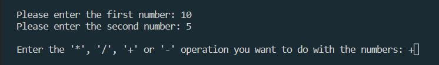
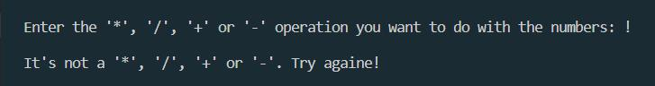
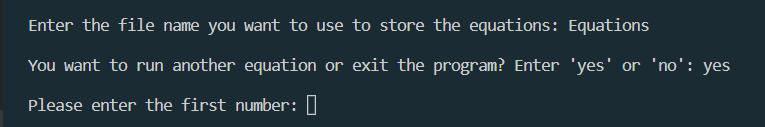
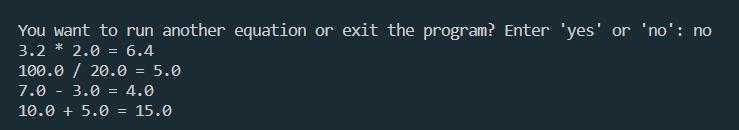

# Calculator

A simple calculator application that prompts the user to enter two numbers and the '*', '/', '+', '-' operation they would like to perform on the numbers. The entered equations are written to a file and printed.

## Table of contents
- [Installation](#Installation)
- [Usage](#Usage)
- [Author of the project](#Author-of-the-project)

### Installation

Copy the code and paste it into your project.

### Usage

When starting the programme, the user must enter two numbers (integers or floating point) and a statement.

The program handles unexpected events and user actions and does not allow you to enter anything other than numbers or operators '*', '/', '+', '-'.

After the calculation, the program will print the equation and prompt you to enter the file name in which all equations will be stored. If the file has not been created before, the program will create it automatically.
After creating the file, the program prompts the user to create another equation, if the user agrees, the program will start again.

If the user selects no, then the program prints all equations and exits.

### Author of the project

Tetiana Hartley.