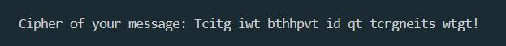

# Caesar's cipher

Encrypts the message using the 'Caesar' cipher, in which every 15th letter of the alphabet, to the right after the letter that is in the message e.g. a is replaced by p. The substitution takes place in a circle of the alphabet. Capital letters remain uppercase, spaces, numbers and other characters remain unchanged.
___

**INSTALLATION.**
Copy the code and paste it into your project. You can replace the value by changing the 'key' to any number to indicate how many letters to the right the substitution will take place.

**USING.**
After starting the programme, enter the message to be encrypted and press enter.

 

The software prints out the result of the encryption of your message.

 

**AUTHOR OF THE PROJECT.**
Tetiana Hartley.