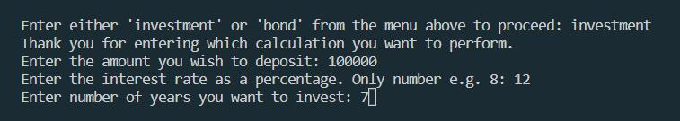

# Financial calculator

Program that allows the user to access two different financial calculators: an investment calculator calculates _“simple”_ or _“compound”_ interest and a home loan repayment calculator.
___

**INSTALLATION.**
Copy the code and paste it into your project.

**USING.**
When starting the programme, the user must select the calculation to be performed.

**Investment.** The user must enter:
1. The amount of money that they are depositing.
2. The interest rate (as a percentage).
3. The number of years they plan on investing.

Ask the user to input if they want _“simple”_ or _“compound”_ interest.

Print out the answer. Amount that the user will receive back after a specified period, at a specified interest rate.

**Bond repayment.** The user must enter:

1. The present value of the house.
2. The interest rate.
3. The number of months they plan to take to repay the bond.

Print out the answer. Amount user will have to repay each month.

**AUTHOR OF THE PROJECT.**
Tetiana Hartley.